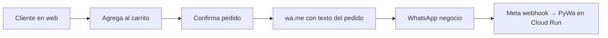

# Flujos de usuario

## 1. Descubrimiento y navegación (web)

1. La usuaria entra al sitio (ruta principal `/`).
2. Ve listado de productos cargados desde la API (`GET /api/productos`).
3. Puede abrir detalle de un producto (vista HTML con id, p. ej. `/api/detalle/{product_id}` y datos vía `GET /api/producto/{id}`).

**Resultado esperado:** información clara: título, precio, descripción, imágenes (principal destacada).

## 2. Carrito básico

1. Desde el listado o detalle, agrega prendas al carrito (identificador de producto, título, precio, stock si aplica).
2. Ajusta cantidades (+ / −) o elimina líneas.
3. Ve total estimado en el panel del carrito.

**Estado actual (JS):** el carrito vive en variables del navegador y se puede persistir en `localStorage` (`carrito_v1`).

## 3. Checkout → WhatsApp (objetivo de producto)

1. La usuaria pulsa **confirmar pedido** / finalizar compra.
2. El front **abre WhatsApp** (típicamente `https://wa.me/<número>?text=<mensaje_codificado>`) con un **texto prearmado** que incluye:
   - Listado de ítems (prenda, precio unitario o línea según convención que definan).
   - **Cantidad de prendas** / unidades por línea.
   - **Descripción** breve por ítem si se incluye en el mensaje.
   - **Total** del pedido.
3. La usuaria envía ese mensaje desde su WhatsApp al negocio.

**Nota:** El envío lo hace el **cliente** desde su app WhatsApp; el servidor no “abre” el chat por sí solo más allá de redirigir el navegador a `wa.me`.

## 4. Conversación WhatsApp (bot)

1. Meta entrega eventos al webhook del servicio en Cloud Run.
2. **PyWa** procesa mensajes y callbacks (botones).
3. **Estado deseado en roadmap:** interpretar pedidos entrantes, confirmar stock, notificar al admin, o enlazar con `Order` en base de datos.

**Estado actual:** bot con flujo guiado «Ver tienda» (categoría + talle → URL filtrada en la web), registro de pedidos por código y FAQ (envío, tiendas, asesor). Ver [12-bot-whatsapp-conversacion.md](./12-bot-whatsapp-conversacion.md).

## 5. Administración (web)

1. Login admin (`POST /login` con OAuth2 password flow; token JWT).
2. Panel admin (plantilla `admin-panel.html`) para altas de producto y fotos según lo implementado en front.

## Diagrama simplificado (flujo feliz web → WhatsApp)

