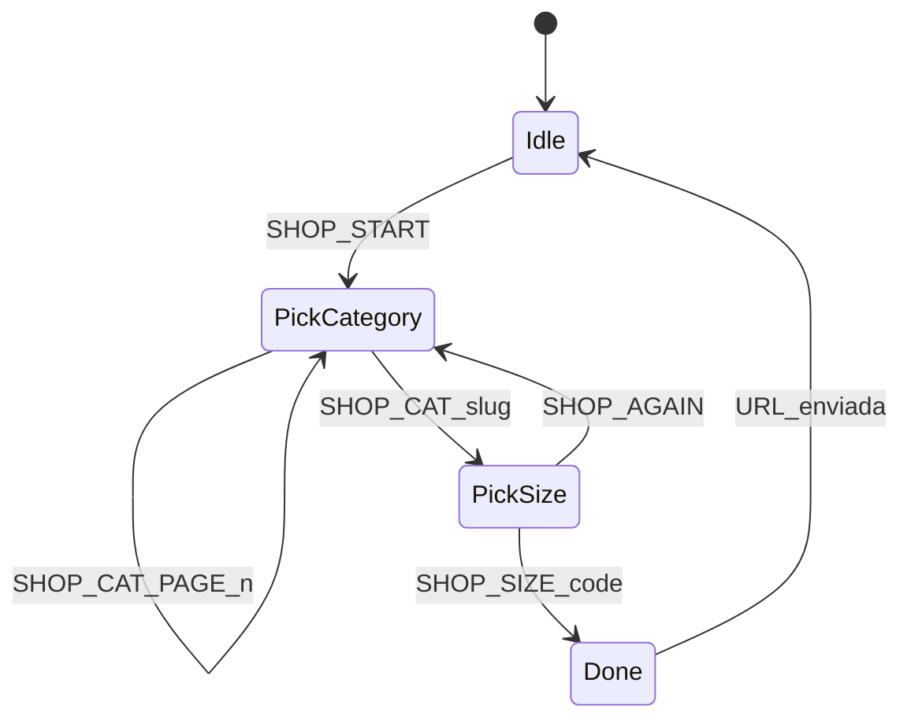

# Bot WhatsApp — conversación y tests

## Arquitectura

| Capa | Archivo | Rol |
|------|---------|-----|
| Conversación | [`whatsapp/conversation.py`](../../whatsapp/conversation.py) | Intents, FAQ, bienvenida |
| Flujo tienda | [`whatsapp/shop_flow.py`](../../whatsapp/shop_flow.py) | Categoría → talle → URL |
| URLs catálogo | [`services/catalog_urls.py`](../../services/catalog_urls.py) | `/?cat=…&size_code=…` |
| Talles por categoría | [`services/sizes.py`](../../services/sizes.py) | Grupo letra/numérico desde DB |
| Handlers PyWa | [`whatsapp/handlers.py`](../../whatsapp/handlers.py) | Webhook, DB, envío de respuestas |
| Config | [`config.py`](../../config.py) | Promo, sucursales, fallback categorías tests |
| Categorías nav / WA | [`services/categories.py`](../../services/categories.py) | Categorías activas desde DB |

Reglas de talles por categoría: ver [`16-talles-catalogo-y-whatsapp.md`](16-talles-catalogo-y-whatsapp.md).  
Categorías del menú y flujo tienda: [`19-categorias-catalogo-admin.md`](19-categorias-catalogo-admin.md).



## Flujo «Ver tienda» (guiado)

1. **Saludo** → [Ver tienda] [Mi pedido] [Asesor]
2. **Categoría** (páginas de 2 + «Siguiente»; última página incluye «Ver todo»)
3. **Talle** — según categoría:
   - *Jeans / pantalones*: talles numéricos (ej. 34, 36 + «Más talles»)
   - *Resto*: talles con letra (ej. S, M + «Más talles»)
   - Texto libre: código válido del grupo, `todos` o `cancelar`
4. **Link** → `http://localhost:5000/?cat=jeans&size_code=38` (según `SITE_PUBLIC_URL`)

La web [`templates/index.html`](../../templates/index.html) lee `size_code` en la URL y lo pasa a `GET /api/productos`.

## Otros flujos

- Código **OJ-…** → registro de pedido web
- **estado OJ-…** → consulta de pedido
- Intents: `envío`, `tiendas`, `asesor`, guía de talles (letra + numérico)
- Texto **jeans** / **catálogo** → entra al flujo tienda (con `wa_id`)

## Tests

```bash
python -m unittest tests.test_whatsapp_conversation tests.test_shop_flow tests.test_catalog_urls -v
```

Sin Meta ni base de datos (el flujo tienda usa fallback de talles; producción lee DB vía handlers).

## Callbacks tienda

| `callback_data` | Acción |
|-----------------|--------|
| `SHOP_START` | Inicia flujo categorías |
| `SHOP_CAT_PAGE:N` | Página N de categorías |
| `SHOP_CAT:jeans` | Elige categoría → pide talle del grupo correspondiente |
| `SHOP_SIZE:38` | Arma URL y cierra sesión |
| `SHOP_SIZE:ALL` | URL sin filtro de talle |
| `SHOP_SIZE_PAGE:1` | Más talles (página siguiente) |
| `SHOP_AGAIN` | Volver a elegir categoría |

Callbacks legacy (`JEANS`, `MENU`, `ESTADO_PEDIDO`, …) siguen en `conversation.py`.

Máximo **3 botones** por mensaje (límite WhatsApp).

## Extender

1. Categorías del nav y bot: admin **Catálogo → Categorías** (tabla `categories`, `activo=true`).
2. Tipo de talle por categoría: mismo CRUD de categorías (`size_group`) o spec 16.
3. Catálogo de talles: admin **Catálogo → Talles**.
4. Copy del flujo: `shop_flow.py` + `tests/test_shop_flow.py`.
5. Nuevo intent: `conversation.py` + `test_whatsapp_conversation.py`.
