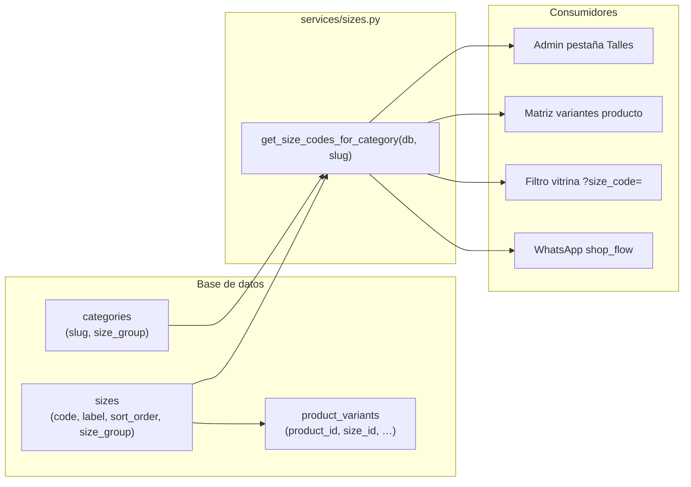

# Talles — catálogo, categorías y WhatsApp

> **Referencia viva.** Consultar este documento antes de tocar talles en admin, tienda, variantes, filtros o bot de WhatsApp.

## Resumen en una frase

Los talles viven en la tabla `sizes` (con tipo `letter` o `numeric`); cada **categoría** define qué tipo usa (`categories.size_group`); admin, web y WhatsApp leen la **misma regla** vía [`services/sizes.py`](../../services/sizes.py).

---

## Problema que resolvimos

Antes, la lógica estaba partida:

| Capa | Antes | Problema |
|------|-------|----------|
| Admin / `GET /api/sizes` | Listas fijas en `config.py` (`SIZE_GROUPS`, `CATEGORY_SIZE_GROUP`) | No editable desde el panel |
| WhatsApp | Siempre S, M, L… hardcodeados | Jeans pedía talle `M` pero los productos usaban 36/38/40 |
| URLs del catálogo | Solo aceptaba letras | `size_code=38` se descartaba |

**Hoy:** todo pasa por la base de datos y un solo servicio.

---

## Modelo mental



### Regla de negocio (la más importante)

1. Cada fila de `sizes` tiene `size_group`: `letter` o `numeric`.
2. Cada fila de `categories` tiene `size_group`: qué tipo de talle ofrece esa categoría.
3. Al filtrar por categoría (admin, API, WhatsApp):
   - Se lee `categories.size_group` para el slug (ej. `jeans` → `numeric`).
   - Se devuelven solo talles de `sizes` con ese mismo `size_group`, ordenados por `sort_order`.

**Ejemplo:**

| Categoría | `categories.size_group` | Talles ofrecidos |
|-----------|-------------------------|------------------|
| `jeans`, `pantalones` | `numeric` | 34, 36, 38, 40, 42… |
| `remeras`, `camperas`, etc. | `letter` | XS, S, M, L, XL, XXL, UNICO… |
| Slug desconocido o `todos` | fallback `letter` | Talles con letra |

Un producto **solo muestra en la tienda** los talles que tengan fila en `product_variants`; la regla anterior define qué talles puede cargar la admin al editar stock.

---

## Datos iniciales (seed)

Definidos en [`database/init_db.py`](../../database/init_db.py):

**Talles letra** (`size_group = letter`): XS, S, M, L, XL, XXL, UNICO

**Talles numéricos** (`size_group = numeric`): 34, 36, 38, 40, 42

**Categorías numéricas por defecto:** `jeans`, `pantalones` — resto en `letter`

Migración Alembic: [`alembic/versions/20260621_0004_size_groups.py`](../../alembic/versions/20260621_0004_size_groups.py)

```bash
python -m alembic upgrade head
```

---

## Fuente de verdad en código

| Qué | Dónde | Notas |
|-----|-------|-------|
| Lógica de talles | [`services/sizes.py`](../../services/sizes.py) | **Único lugar** para reglas de filtrado y CRUD |
| Modelos | [`database/models/Size.py`](../../database/models/Size.py), [`Category.py`](../../database/models/Category.py) | Campo `size_group` en ambos |
| API HTTP | [`main.py`](../../main.py) | Endpoints públicos y `/api/admin/sizes` |
| Admin UI | [`templates/partials/admin_catalog_tab.html`](../../templates/partials/admin_catalog_tab.html), [`static/js/adminSizeCatalog.js`](../../static/js/adminSizeCatalog.js) | Pestaña **Catálogo → Talles** (`?tab=catalog#talles`) |
| WhatsApp categorías | [`whatsapp/handlers.py`](../../whatsapp/handlers.py) | `_shop_categories_resolver()` → `list_categories_for_nav` |
| Variantes producto | [`static/js/adminProductVariants.js`](../../static/js/adminProductVariants.js) | `GET /api/sizes?category_slug=…` al cambiar categoría |
| WhatsApp flujo tienda | [`whatsapp/shop_flow.py`](../../whatsapp/shop_flow.py) | Botones dinámicos + paginación |
| WhatsApp DB | [`whatsapp/handlers.py`](../../whatsapp/handlers.py) | `_shop_sizes_resolver()` → `get_size_codes_for_category` |
| URLs catálogo | [`services/catalog_urls.py`](../../services/catalog_urls.py) | Acepta letras y números (`size_code=38`) |
| Import proveedores | `get_or_create_size_code()` en sizes.py | Auto-crea talle; infiere `numeric` si el code es `\d{2,3}` |
| Fallback tests sin DB | `_FALLBACK_*` en `shop_flow.py` | Solo para unit tests; producción usa DB |

### Qué ya NO usar

- ~~`SIZE_GROUPS` en `config.py`~~ — eliminado
- ~~`CATEGORY_SIZE_GROUP` en `config.py`~~ — eliminado
- ~~`get_size_codes_for_category(slug)` sin `db`~~ — ahora requiere sesión SQLAlchemy

En `config.py` solo queda `DEFAULT_SIZE_GROUP = "letter"` y el seed numérico para `init_db`.

---

## API

| Método | Ruta | Auth | Uso |
|--------|------|------|-----|
| GET | `/api/sizes?category_slug=jeans` | Público | Talles filtrados por grupo de la categoría |
| GET | `/api/sizes` | Público | Catálogo completo |
| GET | `/api/categories` | Público | Incluye `size_group` por categoría |
| GET | `/api/admin/sizes` | Admin JWT | Catálogo completo (pestaña Talles) |
| POST | `/api/admin/sizes` | Admin JWT | `{ code, label, size_group, sort_order? }` |
| PUT | `/api/admin/sizes/{size_id}` | Admin JWT | Editar label, grupo, orden (**code no editable**) |
| DELETE | `/api/admin/sizes/{size_id}` | Admin JWT | Bloqueado si hay `product_variants` |
| GET | `/api/admin/categories` | Admin JWT | CRUD categorías (incluye `size_group`) |
| PUT | `/api/admin/categories/{id}` | Admin JWT | `{ size_group, name, sort_order, activo }` |
| GET | `/api/admin/categories/size-groups` | Admin JWT | **Deprecated** — usar GET `/api/admin/categories` |
| PUT | `/api/admin/categories/{id}/size-group` | Admin JWT | **Deprecated** — usar PUT `/api/admin/categories/{id}` |

---

## Admin panel

### Pestaña Catálogo → Talles (`/admin-panel?tab=catalog#talles`)

Catálogo de talles — alta/edición/baja de códigos (M, 38, etc.) con tipo y orden.

El **tipo de talle por categoría** se configura en **Catálogo → Categorías** (campo `size_group`).

Link «Gestionar talles →» en el formulario de producto (nuevo y editar).

### Convenciones al cargar talles nuevos

- **`code`**: identificador estable (como SKU de talle). No se edita después; se usa en URLs y variantes.
- **`label`**: lo que ve la clienta (puede ser igual al code).
- **`sort_order`**: orden en admin, filtros y botones WhatsApp (menor = primero).
- Agregar `44` numérico **sin** cambiar `categories.size_group` de jeans no alcanza: el talle debe tener `size_group = numeric`.

---

## Tienda web

| Paso | Comportamiento |
|------|----------------|
| Vitrina filtrada | `/?cat=jeans&size_code=38` → `GET /api/productos?cat=jeans&size_code=38` |
| Detalle producto | Chips de talle desde `variantes[]` del producto (solo talles con stock/encargo cargado) |
| Checkout / pedido | `variant_id` + snapshot `size_label_snapshot` en `order_items` |

Ver también [`13-colores-catalogo-y-checkout.md`](13-colores-catalogo-y-checkout.md) (talle + color en pedido).

---

## WhatsApp

Flujo «Ver tienda»: categoría → talle → link filtrado.

Documentación del flujo: [`12-bot-whatsapp-conversacion.md`](12-bot-whatsapp-conversacion.md).

| Categoría elegida | Botones (ejemplo) | URL generada |
|-------------------|-------------------|--------------|
| Jeans | 34, 36, «Más talles» → 38, 40, 42 | `/?cat=jeans&size_code=38` |
| Remeras | S, M, «Más talles» → L, XS, XL | `/?cat=remeras&size_code=M` |
| Texto `todos` | Sin filtro de talle | `/?cat=jeans` (sin `size_code`) |

- Máximo **3 botones** por mensaje (límite WhatsApp).
- Texto libre validado contra `session.available_sizes` (lista resuelta al elegir categoría).
- Intent **Talles** (FAQ): menciona letras para remeras/camperas y numéricos para jeans/pantalones.

**Importante:** el menú de categorías del bot y la web leen categorías activas desde la DB (`list_categories_for_nav`). Ver [`19-categorias-catalogo-admin.md`](19-categorias-catalogo-admin.md).

---

## Checklist al tocar talles

Usar antes de PRs o cambios en producción:

- [ ] ¿Nuevo talle? → Admin **Catálogo → Talles** o `POST /api/admin/sizes` con el `size_group` correcto.
- [ ] ¿Nueva categoría numérica? → Admin **Catálogo → Categorías** con `size_group = numeric`.
- [ ] ¿Categoría nueva en nav/WhatsApp? → Admin **Catálogo → Categorías** (activa, orden); no editar `config.py`.
- [ ] ¿Cambio en botones WA? → Revisar `shop_flow.py` + tests `test_shop_flow.py`.
- [ ] ¿Cambio en filtros web? → Revisar `catalog_urls.py`, `index.html`, `/api/productos`.
- [ ] ¿Migración de esquema? → Nueva revisión Alembic; no usar `create_all` en prod.
- [ ] Ejecutar tests:

```bash
python -m unittest tests.test_sizes_by_category tests.test_sizes_admin tests.test_shop_flow tests.test_catalog_urls -v
```

---

## Casos especiales

### Import desde proveedor (So Chic, etc.)

`get_or_create_size_code()` crea el talle si no existe:

- Code numérico (`36`, `38`) → `size_group = numeric`
- Cualquier otro (`M`, `UNICO`) → `size_group = letter`

### Eliminar un talle

Solo si **no** hay variantes en productos. Si está en uso → HTTP 409 con mensaje para quitar stock primero.

### «Ver todo» en WhatsApp

Categoría `todos` usa fallback `letter` para elegir talle; la clienta puede escribir `todos` para omitir filtro de talle en la URL.

---

## Archivos de test

| Archivo | Qué valida |
|---------|------------|
| `tests/test_sizes_by_category.py` | Filtrado API + helpers con DB |
| `tests/test_sizes_admin.py` | CRUD admin, delete guard, categoría |
| `tests/test_shop_flow.py` | Jeans numérico, remeras letra |
| `tests/test_catalog_urls.py` | URLs con `size_code` numérico y letra |

---

## Historial

| Fecha | Cambio |
|-------|--------|
| 2026-06 | Implementación inicial: DB `size_group`, pestaña admin Talles, WhatsApp alineado, spec 16 |
