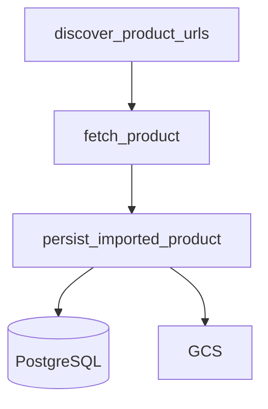

# Scraping masivo por proveedor

Documento de referencia para migrar la ingesta masiva desde el scraper Selenium legacy hacia el runner HTTP basado en `provider_importers`.

Cuaderno de trabajo diario: [`../scraping-migracion-notas.md`](../scraping-migracion-notas.md).

## Objetivo

Reemplazar [`scraper_locas/`](../../scraper_locas/) (Selenium + proxy Ford + cortes hardcode) por un runner HTTP reutilizable que:

1. Descubra URLs de producto en listados paginados.
2. Importe cada ficha con `fetch_product()` del registry.
3. Persista con la misma lógica que el admin (`services/provider_import.py`).

Proveedores objetivo: **Las Locas** (todas las categorías) y **Nissie Denim** (bulk pendiente de selectores de listado).

## Estado legacy (`scraper_locas/`)

| Limitación | Detalle |
|------------|---------|
| Motor | Selenium + ChromeDriver + proxy `internet.ford.com:83` |
| Alcance | Solo `productos/denim` |
| Cortes | `self.pages = 2` y máximo 4 fichas por página ([`Locas.py`](../../scraper_locas/Locas.py)) |
| Persistencia | Insert directo en `Products` sin variantes, colores ni categoría |
| Imágenes | Descarga local + subida GCS desde disco |
| Disparo | Manual; endpoint `/ejecutar-scraper` comentado en `main.py` |

**Deprecación:** mantener solo hasta validar el runner HTTP en producción. No usar para nuevas ingestas.

## Estado moderno (`provider_importers/`)

| Proveedor | Módulo | Login | Imágenes |
|-----------|--------|-------|----------|
| So Chic | `sochic.py` | No | URL remota |
| Las Locas | `laslocas.py` | Sí (`LOGIN_EMAIL`, `LOGIN_PASS`) | Descarga + GCS |
| Nissie | `nissie.py` | No | URL remota |

Import unitario (admin): `POST /api/proveedores/importar` — pestaña **Nuevo producto**.

Import masivo (admin): pestaña **Importación masiva** — ver [21-admin-importacion-masiva.md](./21-admin-importacion-masiva.md).

Import masivo (CLI): `python -m provider_importers.bulk.runner`.

Patrones de identidad, deduplicación e inserción: [18-import-proveedores-patrones.md](./18-import-proveedores-patrones.md).

## Variables de entorno

| Variable | Uso |
|----------|-----|
| `LOGIN_EMAIL` / `LOGIN_PASS` | Sesión Las Locas |
| `DATABASE_URL` o `DB_*` | Persistencia PostgreSQL |
| Credenciales GCS / `STORAGE_MODE` | Subida de imágenes Las Locas |

## Flujo objetivo



Por defecto los productos nuevos se crean con `status=false` (desactivados).

## Las Locas — categorías de listado

Configuración en [`provider_importers/bulk/laslocas_categories.json`](../../provider_importers/bulk/laslocas_categories.json).

| ID | Nombre | URL listado | Paginación | Selector ficha | Verificado |
|----|--------|-------------|------------|----------------|------------|
| denim | DENIM | `/productos/denim` | `#pag a[href*='page']` | `a[href*='ficha']` | Sí |
| chupin | CHUPIN | `/productos/chupin` | igual denim | igual denim | Pendiente |
| oxford | OXFORD | `/productos/oxford` | igual denim | igual denim | Pendiente |
| wide-leg | WIDE LEG | `/productos/wide-leg` | igual denim | igual denim | Pendiente |
| joggers | JOGGERS | `/productos/joggers` | igual denim | igual denim | Pendiente |
| mom | MOM | `/productos/mom` | igual denim | igual denim | Pendiente |
| camperas-y-chalecos | CAMPERAS Y CHALECOS | `/productos/camperas-y-chalecos` | igual denim | igual denim | Pendiente |
| invierno | INVIERNO | `/productos/invierno` | igual denim | igual denim | Pendiente |
| linea-premium | LINEA PREMIUM | `/productos/linea-premium` | igual denim | igual denim | Pendiente |
| joggings-y-calzas | JOGGINGS Y CALZAS | `/productos/joggings-y-calzas` | igual denim | igual denim | Pendiente |
| buzos-y-camisetas | BUZOS Y CAMISETAS | `/productos/buzos-y-camisetas` | igual denim | igual denim | Pendiente |
| bodies-y-vestidos | BODIES Y VESTIDOS | `/productos/bodies-y-vestidos` | igual denim | igual denim | Pendiente |
| accesorios | ACCESORIOS | `/productos/accesorios` | igual denim | igual denim | Pendiente |
| packs | PACKS | `/productos/packs` | igual denim | igual denim | Pendiente |
| verano-remeras | VERANO REMERAS | `/productos/remeras` | igual denim | igual denim | Pendiente |
| verano-musculosas | MUSCULOSAS Y TOPS | `/productos/musculosas-y-tops` | igual denim | igual denim | Pendiente |
| verano-bodies | VERANO BODIES | `/productos/bodies` | igual denim | igual denim | Pendiente |
| verano-polleras | POLLERAS SHORTS BIKERS | `/productos/polleras-shorts-bikers` | igual denim | igual denim | Pendiente |

Actualizar columna **Verificado** en el cuaderno MD al probar cada categoría con `--dry-run`.

## Nissie Denim

| Aspecto | Estado |
|---------|--------|
| Import unitario | Listo — [`nissie.py`](../../provider_importers/nissie.py) |
| Login | No requerido |
| Colores / categoría | Extraídos del JSON-LD (`hasVariant`, breadcrumb) |
| Descubrimiento masivo | Listo — [`nissie_catalog.py`](../../provider_importers/nissie_catalog.py) |
| API masiva | `POST /api/proveedores/nissie/importar-masivo` |
| Patrón `cod_product` | `nissie-{productGroupID}` — ver [18-import-proveedores-patrones.md](./18-import-proveedores-patrones.md) |
| Re-export CLI | [`provider_importers/bulk/nissie_catalog.py`](../../provider_importers/bulk/nissie_catalog.py) |

## Política operativa

- **Productos existentes:** skip por `cod_product` (no sobrescribe).
- **Rate limit:** `--delay-ms` entre fichas (default 500 ms).
- **Dry-run:** `--dry-run` solo lista URLs descubiertas.
- **Cron / Cloud Run:** decisión pendiente; hoy ejecución manual local.

## CLI

```bash
# Smoke test una ficha
python -m provider_importers.bulk.runner --provider laslocas --url https://laslocas.com/ficha-3214-semi-oxford-amber

# Denim completo (dry-run)
python -m provider_importers.bulk.runner --provider laslocas --category denim --dry-run

# Todas las categorías Las Locas
python -m provider_importers.bulk.runner --provider laslocas --all-categories --dry-run

# Import real (desactivados)
python -m provider_importers.bulk.runner --provider laslocas --category denim --delay-ms 800

# Nissie (stub / cuando esté listo)
python -m provider_importers.bulk.runner --provider nissie --category women-jeans --dry-run
```

## Criterios de done

- [ ] Runner HTTP importa denim completo sin errores de precio.
- [ ] Todas las categorías verificadas con dry-run.
- [ ] Nissie bulk operativo (otro chat).
- [ ] `scraper_locas/` marcado deprecated y sin uso en prod.
- [ ] Decisión documentada sobre cron vs manual.
