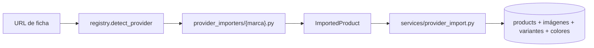
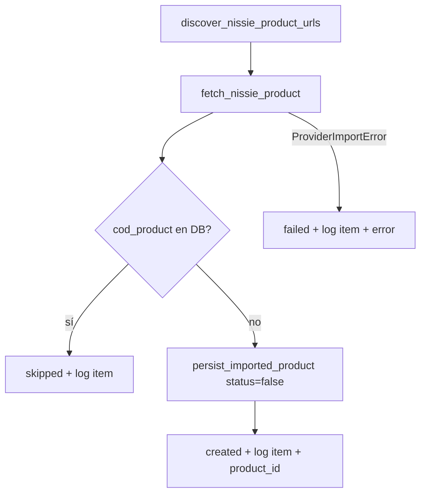

# Patrones de importación por proveedor

Referencia para controlar **cómo se identifica cada producto**, **qué se guarda en la base** y **cómo se inserta** (unitario vs masivo). Nissie Denim es el primer proveedor con import masivo trazable; el mismo esquema sirve de plantilla para otras marcas TiendaNube o sitios similares.

Documentos relacionados:

- [05-datos-y-scraper.md](./05-datos-y-scraper.md) — modelo general y scraper legacy
- [17-scraping-masivo-proveedores.md](./17-scraping-masivo-proveedores.md) — runner CLI y migración desde Selenium

---

## Arquitectura común

Toda marca externa sigue el mismo pipeline:

| Capa | Responsabilidad |
|------|-----------------|
| `provider_importers/registry.py` | Detecta host y delega al importer correcto |
| `provider_importers/{marca}.py` | HTTP + parseo → `ImportedProduct` |
| `provider_importers/types.py` | DTO intermedio (no toca SQLAlchemy) |
| `services/provider_import.py` | Persistencia única: deduplica, crea filas, variantes, colores |
| `main.py` | Endpoints admin (unitario y masivo) |

**Regla de oro:** el importer solo produce `ImportedProduct`. La lógica de inserción vive en un solo lugar (`persist_imported_product`).

---

## Identidad del producto: `cod_product`

`products.cod_product` es la **clave de negocio** para deduplicar. Tiene índice **único** (migración `20260621_0005`).

| Proveedor | Patrón `cod_product` | Origen del ID | Estable ante cambio de slug/URL | Ejemplo |
|-----------|----------------------|---------------|----------------------------------|---------|
| **Nissie** | `nissie-{productGroupID}` | JSON-LD TiendaNube `productGroupID` | Sí | `nissie-282540155` |
| **So Chic** | `sochic-{sku}-{slug}` | SKU WooCommerce + slug URL | Parcial (slug puede cambiar) | `sochic-3515-campera-friza-young-leaders` |
| **Las Locas** | Texto del sitio (`#codProd`) | Código interno Las Locas | Sí (código de ficha) | `BSPOR` |
| Manual / admin | Libre | Alta manual | — | — |

### Por qué Nissie usa solo `productGroupID`

TiendaNube puede cambiar el slug del producto (`/productos/denim-blue/` → otro nombre) pero el **`productGroupID`** del JSON-LD se mantiene. Así una re-ejecución masiva **no duplica** la prenda si solo cambió la URL visible.

Implementación: [`provider_importers/nissie.py`](../../provider_importers/nissie.py) → `_build_cod_product()`.

---

## Qué guarda Nissie en cada capa

### 1. `ImportedProduct` (parseo, en memoria)

| Campo | Origen Nissie | Notas |
|-------|---------------|-------|
| `provider` | Constante `"nissie"` | |
| `source_url` | URL pedida (sin `?variant=`) | Trazabilidad |
| `title` | JSON-LD `ProductGroup.name` o `<h1>` | |
| `description` | JSON-LD `description` o meta | |
| `price` | Primera variante `offers.price` o HTML | Precio **mayorista del sitio**; la admin lo corrige antes de activar |
| `sku` | `productGroupID` (entero) | Mismo ID que TiendaNube |
| `cod_product` | `nissie-{productGroupID}` | Clave de deduplicación |
| `image_urls` | Galería HTML + JSON-LD (URLs CDN mitiendanube, resolución ~640) | No se sube a GCS |
| `image_assets` | Vacío | Las Locas sí usa bytes + GCS |
| `category_slug` | Último ítem del breadcrumb JSON-LD (ej. `jeans`) | Se mapea a `categories.slug` si existe |
| `colors` | `hasVariant[].color` | Se crean/vinculan colores en catálogo local |

### 2. Tabla `products` (persistencia)

| Columna | Valor típico Nissie | Comentario |
|---------|---------------------|------------|
| `cod_product` | `nissie-282540155` | Único |
| `provider` | `nissie` | Filtro admin “Origen” |
| `provider_source_url` | *(columna en esquema)* | Reservada para URL original en producto; hoy la trazabilidad de URL masiva está en `provider_import_run_items` |
| `sku` | `282540155` | Numérico, mismo group ID |
| `item_title` / `name` | Título scrapeado | |
| `description` | Descripción + colores proveedor | Max 1024 chars |
| `price` | Precio scrapeado | **Revisar antes de activar** |
| `status` | `false` en masivo; configurable en unitario | `false` = no visible en tienda |
| `category_id` | FK si el slug coincide | Puede quedar `NULL` |
| `is_sale` / `discount_percent` | Normalmente false/null | Nissie no importa sale por ahora |

### 3. Tablas relacionadas (misma modalidad para todas las marcas)

| Tabla | Qué se crea en import Nissie |
|-------|------------------------------|
| `product_images` | Una fila por URL remota; primera = `is_main` |
| `product_variants` | Una variante con `size_code` del payload (default `UNICO`), stock 0, encargo habilitado |
| `product_colors` | Colores detectados en variantes, si matchean catálogo local |

---

## Modalidades de inserción

### A) Import unitario (admin)

- **Endpoint:** `POST /api/proveedores/importar`
- **Entrada:** URL de una ficha + opciones (`status`, `size_code`, `category_id`, encargo)
- **Comportamiento:**
  - Si `cod_product` **no existe** → INSERT completo
  - Si **existe** → respuesta `created: false` (no actualiza precio ni estado)
- **Estado por defecto:** `status=false` (desactivado)

### B) Import masivo Nissie (admin)

- **Endpoint:** `POST /api/proveedores/nissie/importar-masivo`
- **Descubrimiento:** [`provider_importers/nissie_catalog.py`](../../provider_importers/nissie_catalog.py) — listado `/productos/` + paginación `?page=N` + JSON-LD
- **Orquestación:** [`services/nissie_bulk_import.py`](../../services/nissie_bulk_import.py)
- **Siempre** `status=false`
- **Delay** ~400 ms entre fichas (no saturar TiendaNube)
- **Una corrida activa** por proveedor a la vez

Flujo por URL descubierta:

### C) Re-ejecución (ej. un mes después)

| Situación | Acción del sistema |
|-----------|---------------------|
| Producto nuevo en Nissie | INSERT inactivo |
| Ya importado (activo o inactivo) | **Skip** — no pisa precio ni visibilidad |
| URL falló antes | Queda en log de corrida; reintentar unitario o nueva corrida masiva |
| Producto ya no está en Nissie | **No se borra** del catálogo local (decisión manual) |

---

## Trazabilidad de corridas masivas

Migración `20260621_0005` — tablas de auditoría:

### `provider_import_runs`

| Campo | Uso |
|-------|-----|
| `run_id` | ID de corrida |
| `provider` | `nissie` |
| `status` | `running` \| `completed` \| `failed` |
| `discovered` / `created` / `skipped` / `failed` | Contadores |
| `triggered_by` | Usuario admin |
| `started_at` / `finished_at` | Tiempos |

### `provider_import_run_items`

| Campo | Uso |
|-------|-----|
| `source_url` | URL que se intentó importar |
| `cod_product` | Si se llegó a parsear |
| `status` | `created` \| `skipped` \| `failed` |
| `error_message` | Motivo si falló |
| `product_id` | FK al producto creado (si aplica) |

**Consulta API:**

- `GET /api/proveedores/importaciones/{run_id}` — detalle + fallidos
- `GET /api/proveedores/importaciones/ultima?provider=nissie` — última corrida

---

## Cómo ve la admin el trabajo pendiente

| Cola | Dónde | Filtro |
|------|-------|--------|
| **Revisar precio y activar** | Lista de productos admin | Estado = *Solo inactivos* + Origen = *Nissie* |
| **Errores de import** | Panel “Importación masiva Nissie” | Lista de URLs fallidas de la última corrida |

En la tienda pública, `status=false` implica que el producto **no aparece** en la vitrina.

---

## Checklist para agregar una nueva marca

Usar Nissie como referencia cuando el sitio sea TiendaNube (JSON-LD `ProductGroup`).

1. **Definir identidad estable**
   - Elegir campo inmutable del sitio (group ID, SKU interno, código de ficha).
   - Definir patrón: `{proveedor}-{id}` (max 50 chars en `cod_product`).
   - Documentar en este archivo (nueva fila en la tabla de patrones).

2. **Implementar importer**
   - `provider_importers/{marca}.py` → `fetch_*` + `parse_*` → `ImportedProduct`.
   - Registrar hosts en `registry.py`.

3. **Tests**
   - `tests/test_{marca}_importer.py` con HTML fixture.
   - Assert de `cod_product`, precio, colores.

4. **Catálogo masivo (opcional)**
   - `{marca}_catalog.py` — descubrimiento de URLs.
   - `services/{marca}_bulk_import.py` — reutilizar `persist_imported_product`.
   - Endpoints + UI admin (botón + polling + log).

5. **Operativa**
   - Masivo siempre `status=false` hasta revisión de precio.
   - Skip por `cod_product` en re-runs.
   - Registrar corridas en `provider_import_runs` / `_items`.

6. **Actualizar docs**
   - Fila en tabla de patrones (este archivo).
   - [17-scraping-masivo-proveedores.md](./17-scraping-masivo-proveedores.md) si hay CLI o categorías.

---

## Comparativa rápida de proveedores actuales

| | Nissie | So Chic | Las Locas |
|---|--------|---------|-----------|
| Plataforma | TiendaNube | WooCommerce | Custom |
| Login | No | No | Sí (`LOGIN_EMAIL` / `LOGIN_PASS`) |
| Imágenes | URL remota | URL remota | Descarga + GCS |
| `cod_product` | `nissie-{groupId}` | `sochic-{sku}-{slug}` | `#codProd` del HTML |
| Masivo admin | Sí | No (solo unitario) | Ver [17](./17-scraping-masivo-proveedores.md) / CLI |
| Colores en import | Sí (variantes) | Sí (tabla/grid) | No automático |
| Categoría | Breadcrumb → slug | `product-category` URL | No automático |

---

## Archivos clave (Nissie)

| Archivo | Rol |
|---------|-----|
| [`provider_importers/nissie.py`](../../provider_importers/nissie.py) | Parseo de ficha |
| [`provider_importers/nissie_catalog.py`](../../provider_importers/nissie_catalog.py) | URLs del listado |
| [`services/nissie_bulk_import.py`](../../services/nissie_bulk_import.py) | Corrida masiva |
| [`services/provider_import.py`](../../services/provider_import.py) | INSERT compartido |
| [`database/models/Products.py`](../../database/models/Products.py) | `provider`, `cod_product` |
| [`database/models/ProviderImportRun*.py`](../../database/models/ProviderImportRun.py) | Auditoría masiva |
| [`templates/admin-panel.html`](../../templates/admin-panel.html) | Botón masivo + filtros |

---

## Decisiones pendientes / mejoras

- Poblar `products.provider_source_url` desde `ImportedProduct.source_url` en cada persist (hoy la URL vive en items de corrida masiva).
- Unificar patrones `cod_product` de So Chic hacia un ID más estable (similar a Nissie).
- Sync de precio/stock en re-import (hoy explícitamente **fuera de alcance** — solo novedades).
- Generalizar `nissie_bulk_import` → `services/provider_bulk_import` parametrizado por proveedor.
